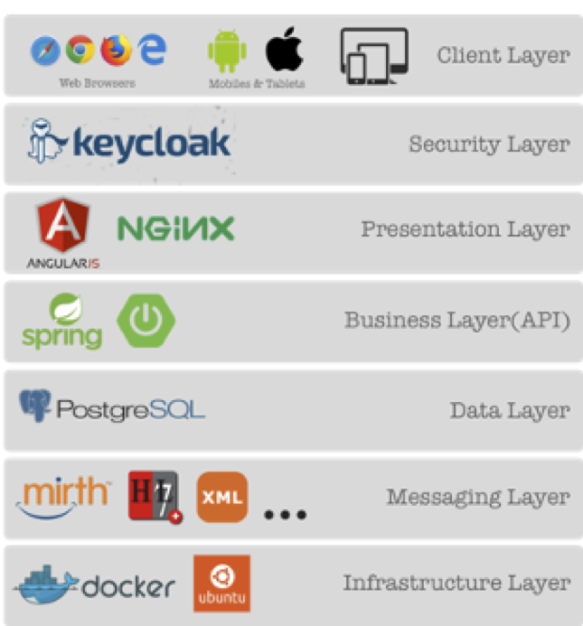

Main components of OSIP
=====

The components that make up the OSIP have all been carefully selected for their flexibility, functionality and applicability to healthcare. 

Messaging Layer: I/O server
-----

Most legacy systems can only interact thorough file-based interfaces in a semi-standardised format. To capture that data and to interact with these systems you need a robust I/O engine. Ideally you should be able to configure new data streams without affecting existing ones. And your system should be able to scale without performance issues.
OSIP achieves this by using the mirth-connect engine now called “NextGen Connect” in the open-source version (https://www.nextgen.com/products-and-services/integration-engine). It should be noted that additional code has been developed and is provided to complement the interface engine and ensure it works well within a healthcare environment.   

Data Layer: Database
-----

Granular data stored in a relational database makes up the persistence layer of the OSIP. This RDBS (Relational Database System) contains the patient data, the app specific data, the user data, all the logs and everything else that the platform needs to operate. Our configuration allows load-balancing where needed and the use secure replication to connect an on-premise environment to the cloud.
We use PostgreSQL as this is the world's most advanced open source relational database (https://www.postgresql.org/). PostgreSQL was also the first RDBS to address the need to store some non-SQL elements. This is essential when storing JSON messages with variable content.

Security Layer: ID server
-----

KeyCloak provides a powerful and standard conformant ID-server (https://www.keycloak.org/). Federating corporate identities is essential and being able to federate social-media identities and act itself as an ID provider is becoming more and more important. Furthermore, this server is the key to our internal access management. 

Middleware
-----

An established workflow engine could be used to power your business’ processes, however as healthcare data and associated workflow are fairly unique to healthcare, we chose to program the business rules from scratch rather than adapt and be constrained to existing tools. 
Therefore, our middleware is fully custom code written in Java. This programming language is one of the most used and well adopted in all industries. It is platform agnostic and runs well almost anywhere. We use OpenJDK to ensure we have the correct open source licenses (http://openjdk.java.net/).

Web apps
-----

Our web apps are developed in Angular (https://angular.io/). We believe that this is the most versatile framework for our type of application. It gives us the ability to use the system resources of end users’ devices and allows us to bridge some network gaps in mobile and Wi-Fi networks. With modern system environments you can even provide progressive-web-apps (PWA) and improve the overall end user experience.
