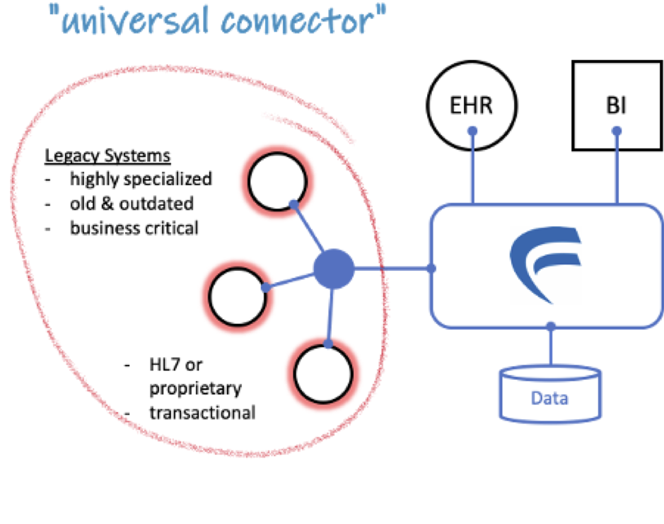
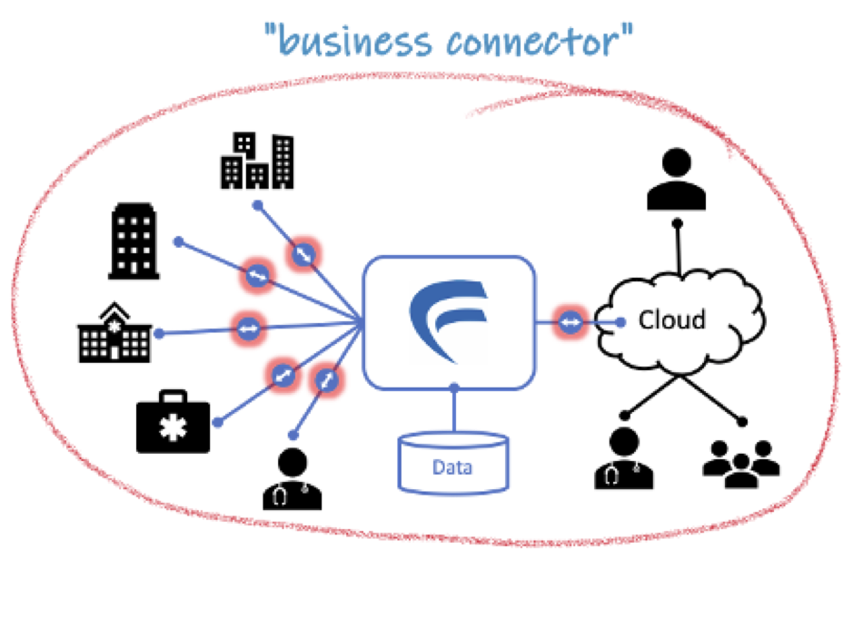

Implementation scenarios
=====

Integration of legacy systems
-----

In a specialised clinical environment, you sometimes have to use some outdated equipment which is perfect for a specific task but lacks any standard interfacing options. OSIP can connect these systems to the rest of your ecosystem and share their data to third parties safely and securely.
With OSIP you can continue with a best-of-breed strategy and in addition implement a company wide data management strategy. 

 
Orchestration of dataflows 
-----

Most of your clinical and administrative systems need similar patient related information. Far too often users still spend their time copying data from one system to another. Peer-to-peer interfacing from one system to another can solve some of this pain, but it's difficult to keep track of your data flows the more systems you try to connect and maintain these interfaces if systems are updated.
Using OSIP as an enterprise application integration (EAI) tool, you can connect your systems directly to one instance and manage your data flows through it. This gives you the ability to monitor traffic and to implement appropriate business rules.

Connect different work sites
-----

Healthcare providers tend to aggregate business from different sites. This may stem from organisational mergers or organic growth, and often results in IT departments spending effort and resources to synchronise systems and solutions.
With OSIP you are able to connect multiple sites with different primary systems and still be able to exchange and consolidate patient specific data. You can connect to external partners without giving them access to your internal network. We also support the use of public cloud providers to assist with this.

Provide an ecosystem for apps
-----

The leadership and innovation team of the average healthcare provider normally receives plenty of suggestions to implement different kind of apps and functionality. While many of these apps are not mature enough to be used in a professional healthcare environment, there are still some good and innovative ideas. However, connecting apps to your existing legacy systems is painful and often does not provide the desired results.
OSIP gives you the ability to connect apps through simple and well secured APIs. You’re not dependent on the willingness of your providers to create standard conformant interfaces. Instead you can fuel some brilliant app programmers with a simple way to interact with your data without risk and at minimal cost.

 ----
 **Table of Contents**
 
 [A. Introduction](A_introduction.md)
 
 [B. Innovation and Open Technology](B_innovation_and_open_technology.md)
 
 [C. OSIP Functionality](C_osip_functionality.md)
 
 [D. Outside the current scope of OSIP](D_outside_the_current_scope_of_osip.md)
 
 [E. Main Components of OSIP](E_main_components_of_osip.md)
 
 [F. System environment for OSIP](F_system_environment_for_osip.md)
 
 G. Implementation scenarios
